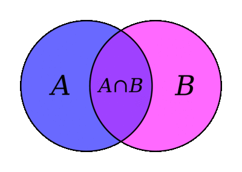

[](https://urbanjost.github.io/M_sets/fpm-ford/index.html)
# [M_sets](https://urbanjost.github.io/M_sets/man3.html)

## Name
   **M_sets**(3f) - functions reminiscent of Matlab set functions

## Description

Set-theory operations compare the elements in two sets to find
commonalities, differences, and membership.

M_set(3f) is a Fortran module comprising a small group of set-theory
functions reminiscent of related Matlab procedures.

M_set(3f) is intended to be built with and used by fpm(1) projects.
It requires the M_orderpack(3f) as a dependency, which is of course
taken care of automatically via fpm(1).

Currently the allowed sets are vectors of integer numbers or arrays
of character variables. real numbers are allowed but "caveat emptor",
as comparing floats for equality has issues. You may have to condition
the float date by converting it to scaled integers or using intrinsics
such as NEAREST(3f) to produce the desired results.

<!--
M_sets(3f) basically uses some simple calls to the M_orderpack(3f)
module that make loose use of memory allocation and space, but are
adequate for the vast majority of cases.
-->

## Functions
 + union(A,B,setOrder)     - Join two sets and remove duplicates of values
 + unique(A,setOrder)      - Remove duplicates of values from a set
 + intersect(A,B,setOrder) - Find the values common to both A and B
 + setdiff(A,B,setOrder)   - Find the values in A that are not in B
 + ismember(A,B,setOrder)  - Create a mask of A marking elements also in B
 + setxor(A,B,setOrder)    - Find values of A and B not in both arrays
 + issorted(A)             - Determine if array is already sorted

 The subsequent data may be produced sorted, or left in the order
 encountered.

## Example

```fortran
   program demo_M_sets
   use M_sets, only: &
   & unique, intersect, union, setdiff, ismember, setxor, issorted
   character(len=*),parameter :: g='(*(g0,1x))'
   integer, allocatable      :: A(:)
   integer, allocatable      :: B(:)
   integer, allocatable      :: C(:)

      write(*,g) 'UNIQUE','Find the unique elements of vector A.'
       A = [10, -10, 0, 1, 2, 3, 3, 2, 1, -10]
       write(*,g) 'A=', A
       write(*,g) unique(A)
       write(*,g) unique(A, setOrder='stable')
      write(*,g) 'UNION', 'Find the union of vectors A and B.'
       call setab( [5, 7, 1], [3, 1, 1] )
       write(*,g) union(A,B)
       call setab( [5, 5, 3], [1, 2, 5] )
       write(*,g) union(A, B, 'sorted')
       write(*,g) union(A, B, 'stable')
      write(*,g) 'INTERSECT', 'Find the values common to both A and B.'
       call setab( [7, 1, 7, 7, 4], [7, 0, 4, 4, 0] )
       write(*,g) intersect(A, B)
       write(*,g) intersect(A, B, setOrder='stable')
      write(*,g) 'SETDIFF','Find the values in A that are not in B.'
       call setab( [3, 6, 2, 1, 5, 1, 1], [2, 4, 6] )
       write(*,g) setdiff(A, B)
       call setab( [4, 1, 3, 2, 5], [2, 1])
       write(*,g) setdiff(A, B, 'sorted')
       write(*,g) setdiff(A, B, 'stable')
      write(*,g) 'ISMEMBER', &
      'Determine which elements of A are also in B.'
       call setab( [5,3,4,2], [2,4,4,4,6,8] )
       write(*,g) ismember(A,B)
      write(*,g) 'SETXOR',&
      'Find values of A and B not in their intersection.'
       call setab( [5,1,3,3,3], [4,1,2] )
       write(*,g) setxor(A,B)
       write(*,g) setxor(A,B,'stable')

       write(*,g) 'ISSSORTED',&
       'confirm whether array is sorted in ascending order or not'
       call setab([1,2,3,4,5],[5,4,3,2,1])
       write(*,g) issorted(A)
       write(*,g) issorted(B)

   contains
   subroutine setab(ain,bin)
   integer,intent(in) :: ain(:)
   integer,intent(in) :: bin(:)
      A=ain
      B=bin
      write(*,g) 'A=', A
      write(*,g) 'B=', B
   end subroutine setab

   end program demo_M_sets
```

Results:
```text
 > UNIQUE Find the unique elements of vector A.
 > A= 10 -10 0 1 2 3 3 2 1 -10
 > -10 0 1 2 3 10
 > 10 -10 0 1 2 3
 > UNION Find the union of vectors A and B.
 > A= 5 7 1
 > B= 3 1 1
 > 1 3 5 7
 > A= 5 5 3
 > B= 1 2 5
 > 1 2 3 5
 > 5 3 1 2
 > INTERSECT Find the values common to both A and B.
 > A= 7 1 7 7 4
 > B= 7 0 4 4 0
 > 4 7
 > 7 4
 > SETDIFF Find the values in A that are not in B.
 > A= 3 6 2 1 5 1 1
 > B= 2 4 6
 > 1 3 5
 > A= 4 1 3 2 5
 > B= 2 1
 > 3 4 5
 > 4 3 5
 > ISMEMBER Determine which elements of A are also in B.
 > A= 5 3 4 2
 > B= 2 4 4 4 6 8
 > 0 0 1 1
 > SETXOR Find values of A and B not in their intersection.
 > A= 5 1 3 3 3
 > B= 4 1 2
 > 2 3 4 5
 > 5 3 4 2
```
<!--
## Building the module using make

This will compile the Fortran module and basic example programs that exercise the routines:

```bash
     git clone https://github.com/urbanjost/M_sets.git

     cd M_sets/src
     # change Makefile if not using one of the listed compilers

     # for gfortran
     make clean
     make gfortran

     # for ifort
     make clean
     make ifort

     # for nvfortran
     make clean
     make nvfortran
```
   Note that to specifically get release 2.0.0 you would use
```bash
     git clone --branch 2.0.0 https://github.com/urbanjost/M_sets.git
```
-->

---
## Build and test with 

   Download the github repository and build it with fpm ( as described at
   [Fortran Package Manager](https://github.com/fortran-lang/fpm) )
```bash
        git clone https://github.com/urbanjost/M_sets.git
        cd M_sets
        fpm build
```

   or just list it as a dependency in your fpm.toml project file.

```toml
        [dependencies]
        M_sets        = { git = "https://github.com/urbanjost/M_sets.git" }
```
---
## Documentation 

The documenation for each procedure is included in the source.
That documentation is also available as a flat text file, HTML
documents, and man-pages.

### User
   - A [text manual](https://urbanjost.github.io/M_sets/manual.txt)
     contains all the procedure descriptions in a single flat ASCII
     text file.

   - [routines](https://urbanjost.github.io/M_sets/man3.html)
     are also described in HTML form using the format of man-pages.
<!--
     and [programs](https://urbanjost.github.io/M_sets/man1.html)
-->
   - For easier searching and printing Javascript is used to combine
     all those HTML descriptions of the man-pages into a single
     [book](https://urbanjost.github.io/M_sets/BOOK_M_sets.html).

   -  are the de-facto standard
     method of providing procedure descriptions on Unix, GNU/Linux,
     OpenBSD, Cygwin, WLS, and other ULS (Unix-Like Systems)

     Installation can vary depending on whether you are installing
     personal copies or as an adminstrator, but man-pages are well suited
     for any CLI user (Command-Line Interface):

      + [manpages.zip](https://urbanjost.github.io/M_sets/manpages.zip)
      + [manpages.tgz](https://urbanjost.github.io/M_sets/manpages.tgz)

   - [CHANGELOG](docs/CHANGELOG.md) provides a history of significant changes
---
### Developer
   - [ford(1) output](https://urbanjost.github.io/M_sets/fpm-ford/index.html).
   - [doxygen(1) output](https://urbanjost.github.io/M_sets/doxygen_out/html/index.html).
   - [github action status](docs/STATUS.md)
---

## References 

## See also 
   * [M_orderpack](https://github.com/urbanjost/M_orderpack)
   * [M_random](https://github.com/urbanjost/M_random)
